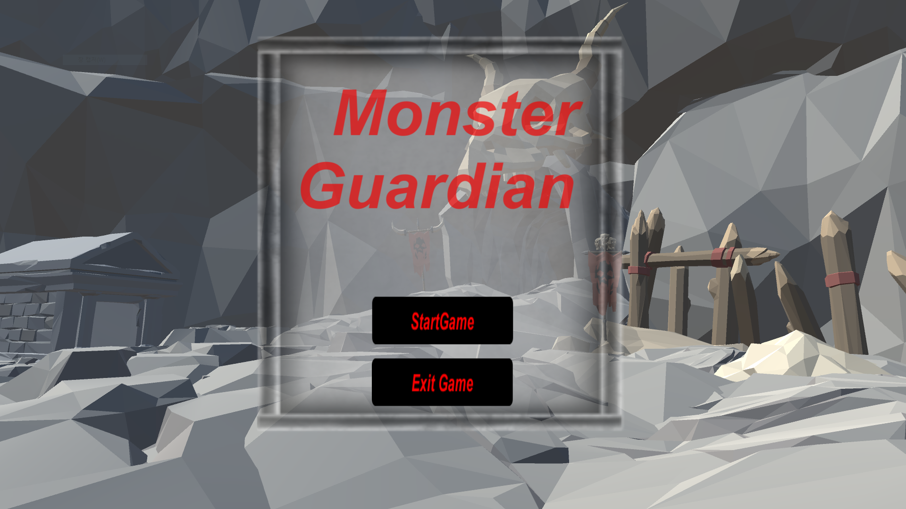
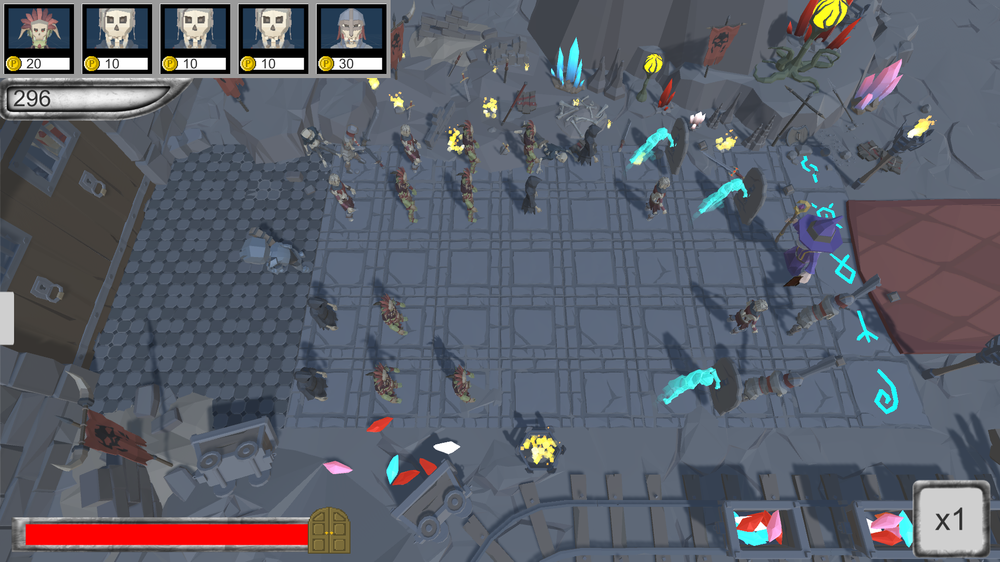
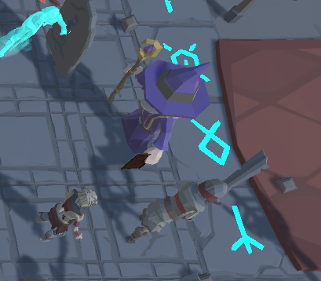

# GStar2021 — Grid Tile Defense (Showcase)

Unity로 만든 **그리드 기반 타워 디펜스 게임**. 12×5 타일에 유닛을 배치해 스테이지별 웨이브와 보스를 막아내는 구성. 학과 실습 과제(2021)로 개발한 개인 프로젝트이며, 게임 엔진·컴포넌트 기반 아키텍처·상태 관리를 처음으로 경험한 초창기 학습 프로젝트다.

> 이 리포는 **포트폴리오 열람용 쇼케이스**다. Unity 프로젝트 원본(`GStar2021`)에는 유료 3rd-party 에셋(Synty Polygon Dungeon·Characters, Warforge UI 등)이 포함되어 있어 라이선스상 재배포할 수 없다. 여기엔 **본인이 작성한 스크립트(43개)와 스크린샷·플레이 영상**만 담는다.

---

## 스크린샷 / 데모

<!-- 스크린샷을 screenshots/ 폴더에 넣고 이 자리에 렌더링 -->

| 타이틀 | 게임 플레이 | 보스 웨이브 |
|--------|-------------|-------------|
|  |  |  |

**플레이 영상**: [YouTube 링크 자리]

---

## 프로젝트 개요

| 항목 | 내용 |
|------|------|
| 엔진 | Unity 2021.x |
| 언어 | C# (MonoBehaviour) |
| 장르 | 타일 그리드 디펜스 |
| 플레이 뷰 | 3D 탑다운 |
| 개발 기간·형태 | 학과 실습 프로젝트, 개인 개발 |
| 스크립트 수 | 43개 (~약 130KB) |

---

## 스크립트 구조

```
Scripts/
├─ RockGolem/         골렘 관련 로직
├─ Weapon/            무기 시스템
│
├─ Player.cs          플레이어
├─ Unit.cs            유닛 베이스 클래스 (Player·Enemy·TeamUnit 공통)
├─ Enemy.cs           적 유닛 (약 35KB — 최대 스크립트)
├─ TeamUnit.cs        아군 유닛
│
├─ TileMaker.cs       12×5 그리드 맵 생성
├─ Tile.cs            개별 타일 로직
├─ TileStatus.cs      전역 타일 점유 상태
│
├─ CreateEnemy.cs     웨이브·보스 스폰
├─ StageController.cs 스테이지 선택·페이드 전환
├─ StageWindow.cs     스테이지 UI
├─ Door.cs            방어 대상 오브젝트
│
├─ NecromancerBoss.cs 보스 1 (약 18KB)
├─ PiratesBoss.cs     보스 2 (약 12KB)
├─ WizardBoss.cs      보스 3
│
├─ Skills.cs          스킬 시스템
├─ Soul_Attack.cs     영혼 공격 스킬
├─ Spear_magic.cs     창 마법
├─ FireBoll.cs        화염구
├─ JjangDol.cs        돌 던지기
│
├─ UpgradeUI.cs       업그레이드 UI
├─ UpgradeUnits.cs    유닛 업그레이드 로직
├─ UnitBox.cs, UnitCard.cs   유닛 카드 UI
├─ StartPanel.cs, Title.cs, Pause.cs   메뉴 UI
├─ FastButton.cs      게임 속도 배속
│
├─ BgmManager.cs      싱글턴 BGM 매니저
├─ MouseManager.cs    마우스 입력
├─ Point.cs           점수
├─ TeamStats.cs       팀 통계
├─ AutoDestroy.cs     자동 파괴 유틸
└─ ParticleArr.cs     파티클 관리
```

---

## 핵심 시스템

### 1. 타일 기반 맵 생성 (`TileMaker.cs`)

12×5 크기의 2D 배열로 타일을 관리한다. 시작·종료 영역은 고정 프리팹, 중간 영역은 3종 프리팹을 랜덤으로 배치해 매판 조금씩 다른 지형을 만든다.

```csharp
GameObject[,] tiles = new GameObject[12, 5];

for (int i = 0; i < 12; i++) {
    for (int j = 0; j < 5; j++) {
        int prefabIdx;
        if (i < 3) prefabIdx = 3;                  // 배치 존
        else if (i == 11) prefabIdx = 4 + j;       // 적 스폰 존
        else prefabIdx = Random.Range(0, 3);       // 중간 랜덤

        tiles[i, j] = Instantiate(tilePrefabs[prefabIdx],
                                  new Vector3(i * 5, 0, j * 5),
                                  Quaternion.identity);
        tiles[i, j].GetComponent<Tile>().InitPos(i, j);
    }
}
```

**설계 포인트**: 타일이 자신의 좌표를 `InitPos`로 받아 자체 상태를 관리 → 게임 로직이 좌표 비교 대신 타일에게 직접 질의하는 방식으로 단순화.

### 2. 타일 상태 전역 관리 (`TileStatus.cs`)

`[너비, 높이, 편(아군/적)]` 3차원 배열을 정적 필드로 두고 유닛 배치·이동을 전역 상태로 추적한다.

```csharp
public static int[,,] tileStatus = new int[12, 5, 2];
// tileStatus[x, y, 0] = 아군 유닛 id (없으면 0)
// tileStatus[x, y, 1] = 적 유닛 id
```

**학습**: 전역 상태의 편의성 vs 결합도 문제를 몸으로 배운 지점. 이후 프로젝트에서 이벤트·ScriptableObject 기반으로 대체 시도.

### 3. 유닛 스탯 베이스 클래스 (`Unit.cs`)

`Player`, `Enemy`, `TeamUnit`이 공통으로 상속하는 기본 스탯 컨테이너.

```csharp
public class Unit : MonoBehaviour {
    protected float max_health, current_health;
    protected float damage;
    protected float move_speed, current_move_speed;
    protected float attack_speed, attack_range;

    public float Damage { get => damage; set => damage = value; }
    public float Current_health { get => current_health; set => current_health = value; }
    // ...
}
```

### 4. 웨이브·보스 스폰 (`CreateEnemy.cs`)

스테이지별로 웨이브당 스폰 수를 관리(스테이지 1: 10→15→보스, 2: 15→17→보스, 3: 17→20→보스). 1초 간격 타이머 기반 스폰, 5명씩 배치. 웨이브 3에선 고유 보스를 지정 타일에 소환하며 해당 타일의 아군은 즉시 제거해 공간을 확보한다.

```csharp
if (wave == 3) {
    Instantiate(bossPrefab, new Vector3(10 * 5, 0, 2 * 5), Quaternion.identity);
    if (TileStatus.tileStatus[10, 2, 0] != 0) {
        Destroy(GameObject.Find($"TeamUnit_{TileStatus.tileStatus[10, 2, 0]}"));
        TileStatus.tileStatus[10, 2, 0] = 0;
    }
}
```

### 5. 스테이지 전환·페이드 (`StageController.cs`)

```csharp
void Update() {
    if (fading) {
        color.a += 0.01f * Time.deltaTime * 40f;
        image.color = color;
        if (color.a >= 1f) SceneManager.LoadScene("GameScene");
    }
}
```

`DontDestroyOnLoad`로 씬 전환 시 페이드 오브젝트 유지.

### 6. 스킬·투사체 시스템

각 스킬 오브젝트가 자기 파괴 로직(`AutoDestroy`)과 파티클 트리거를 포함한다.

- `Soul_Attack.cs` — 영혼 공격 (관통형)
- `Spear_magic.cs` — 창 마법
- `FireBoll.cs` — 화염구
- `JjangDol.cs` — 돌 던지기

### 7. 사운드 관리 (`BgmManager.cs`)

씬 전환에도 살아남는 싱글턴 BGM 매니저. 스테이지·타이틀·전투 BGM을 분리 관리.

---

## 이 프로젝트에서 배운 것

이 리포는 **엔진과 컴포넌트 기반 개발을 처음 익힌 시점**의 결과물이다. 현재 관점에서 보면 개선할 지점이 많고, 그 자체가 학습의 기록이다.

**엔진·프로그래밍 개념**
- MonoBehaviour 라이프사이클(Awake·Start·Update)과 오브젝트 생성 흐름
- Prefab·Instantiate 기반 오브젝트 관리
- 물리·충돌 처리, 애니메이터 스테이트 머신
- 3D 좌표 변환과 그리드 매핑

**설계 관점의 학습(회고)**
- 전역 정적 상태(`TileStatus`)의 편의성과 그 대가 → 이후 프로젝트에서 이벤트·ScriptableObject 기반으로 대체 시도
- 스탯을 필드로 직접 관리하는 방식의 한계 → 데이터/로직 분리와 상태 머신 필요성 체감
- 웨이브 수·보스 위치 등 하드코딩의 관리 부담 → 후속 프로젝트에서 데이터 주도 설계(config 파일·JSON) 채택
- 커밋 히스토리와 버전 관리 습관 부재 → 이후 프로젝트부터 커밋 단위·메시지 규칙 정립

---

## 한계 및 개선점 (Honest note)

- 스크립트 간 결합도가 높음 (정적 상태 참조 다수)
- 네이밍 컨벤션 불일치 (PascalCase, snake_case, camelCase 혼재)
- 테스트 코드 없음
- 리소스 로딩·에셋 참조가 직접 참조 위주 (Addressable 미사용)
- 커밋 히스토리가 초창기 개발 습관을 반영

이 프로젝트의 목적은 완성도 있는 상업 게임보다 **엔진 학습 및 완주**였고, 그 목적은 달성했다. 이후 프로젝트에서 이 리포의 개선점을 반영해 나가고 있다.

---

## 라이선스

- 이 리포에 포함된 **C# 스크립트는 본인이 작성**한 코드로, 학습·열람 목적의 공개다.
- 원본 Unity 프로젝트에 포함된 3rd-party 에셋(Synty Polygon 시리즈, Warforge Mobile UI 등)은 각 원저작자의 EULA를 따르며 이 리포에는 **포함되지 않는다**.
- 스크린샷·영상 속 3D 모델·UI 리소스의 저작권은 각 원저작자에게 있다.
